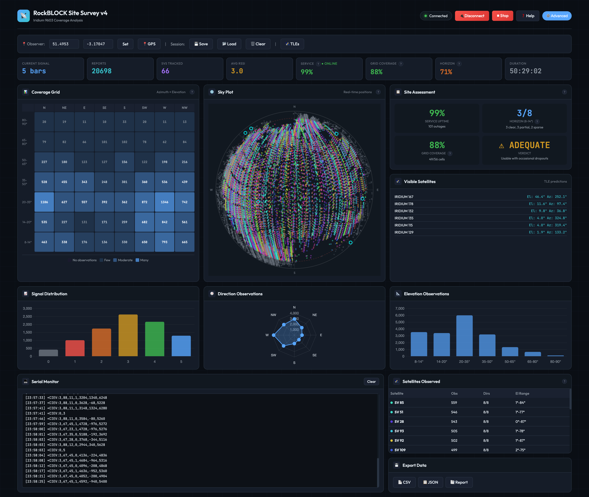

# RockBLOCK Site Survey Tool v4

A browser-based tool for evaluating Iridium satellite visibility at a proposed RockBLOCK/SBD/Certus installation site.

## Overview

This tool connects directly to an Iridium 9602/9603 modem via Web Serial API and collects CIER (Indicator Event Reporting) data to build a picture of satellite visibility and service availability.

<table>
  <tr>
    <td align="center"><strong>LITE Mode</strong></td>
    <td align="center"><strong>Advanced Mode</strong></td>
  </tr>
  <tr>
    <td></td>
    <td></td>
  </tr>
</table>

**Key Features:**
- Real-time sky plot showing satellite observations (colored by satellite ID)
- Geometric coverage grid (observation counts by direction/elevation)
- Service availability tracking (the most reliable metric)
- Session save/load for multi-day surveys
- CSV, JSON, and text report export
- **LITE/Advanced modes** - Clean objective data view by default, with optional assessment features

## Requirements

- **Browser:** Chrome, Edge, or Opera (Web Serial API required)
- **Hardware:** Iridium 9602/9603 modem with serial/USB connection
- **Modem Firmware:** TA11002 or later (for `+CIEV:3` SV/beam coordinate reporting)

## How to Run

This tool uses ES6 modules and requires a local HTTP server (browsers block module loading from `file://` URLs).

### Option 1: Python (built-in)

```bash
cd v4
python3 -m http.server 8080
```
Then open http://localhost:8080 in your browser.

### Option 2: Node.js (npx)

```bash
cd v4
npx http-server -p 8080
```
Then open http://localhost:8080 in your browser.

### Option 3: VS Code Live Server

Install the "Live Server" extension, right-click `v4/index.html`, and select "Open with Live Server".

## Quick Start

1. Start a local HTTP server (see above)
2. Open the tool in a supported browser
3. Connect your Iridium modem via USB/serial adapter
4. Click **Connect** and select the serial port
5. Set your location (or use browser GPS)
6. Click **Start** to begin logging
7. Run for **48-72 hours** for reliable results
8. Use **Save** to preserve data between sessions

### Demo Session

A sample survey session is included in the `Survey/` folder. Load it via **Load** to explore the tool without hardware.

## LITE vs Advanced Mode

**LITE Mode (default):** Shows objective measurements only - signal strength, satellite reports, service uptime, and duration. The sky plot is larger for better visibility.

**Advanced Mode:** Click the **Advanced** toggle to reveal site assessment features including verdict scoring, horizon analysis, and grid coverage percentages. A disclaimer explains these are heuristic assessments.

## Understanding the Data

### What the Modem Reports

The tool uses AT+CIER to enable four types of indicator events:

| Message | Meaning |
|---------|---------|
| `+CIEV:0,<rssi>` | Signal strength (0-5 bars) |
| `+CIEV:1,<available>` | Service availability (0=offline, 1=online) |
| `+CIEV:2,<fault>` | Antenna fault indicator |
| `+CIEV:3,<sv>,<beam>,<type>,<x>,<y>,<z>` | Satellite/beam position in ECEF coordinates |

### Critical Limitation: RSSI Cannot Be Attributed to Positions

**This is fundamental to the Iridium CIER data, not a tool limitation.**

The modem reports two independent data streams:
1. `+CIEV:0,<rssi>` - Signal strength of the ring channel the modem is currently locked onto
2. `+CIEV:3,<sv>,...` - Position reports from ALL satellites the modem can hear

The Iridium documentation explicitly states:

> "Multiple ring channels can be present at the same time so units can lock to different signals."
> — *Iridium 9603 Developer's Guide*

> "The SV and beam reported are not necessarily the ones that will be used for any subsequent uplink connection attempt."
> — *ISU AT Command Reference*

**What this means:** When the modem reports RSSI, it's for whichever satellite it happens to be locked to at that moment. Simultaneously, it reports position data from every satellite it can receive. There is no field correlating them.

Any tool that color-codes sky positions by RSSI is presenting a false correlation. This tool does not do that.

---

## Metrics (Honest Only)

### Service Uptime (Primary Metric)

Actual measured connectivity - the percentage of time the modem has service available.

- Derived from `+CIEV:1` messages
- Directly answers "can I communicate?"
- No attribution issues - this is ground truth

### Geometric Coverage

Observation counts per sky cell (8 directions × 7 elevation bands).

- Shows where satellites were received from
- Dark/empty cells after 48+ hours indicate obstructions
- Cells show count of observations, not signal quality

### Horizon Visibility (Advanced Mode)

How many compass directions have clear low-elevation (8-20°) visibility.

- **Clear:** Both 8-14° and 14-20° bands have observations
- **Sparse:** Has observations but significantly fewer than best direction
- **Blocked:** Missing observations in one or both horizon bands

### RSSI Distribution (Site-Level)

Histogram of signal quality over the survey period.

- Valid as a site-level metric
- Shows overall RF environment quality
- Cannot be attributed to specific directions

---

## Sky Plot

The polar plot shows satellite observations mapped to sky position:
- **Center** = directly overhead (90° elevation)
- **Edge** = horizon (0° elevation)
- **Red dashed circle** = 8° minimum functional elevation
- **Colored dots** = satellite observations (color = satellite ID, showing orbital tracks)
- **Cyan circles** = predicted satellite positions (if TLEs loaded)

Observations below 8° elevation are shown at reduced opacity.

**Why color by satellite ID?** Each satellite gets a unique color so you can see orbital tracks emerge over time. This is honest - we know which satellite reported each position.

---

## Coverage Grid

Shows observation counts for each segment of sky:
- **Columns** = 8 compass directions (N, NE, E, SE, S, SW, W, NW)
- **Rows** = 7 elevation bands (8-14° at bottom, 80-90° at top)
- **Cell brightness** = relative observation count
- **Cell value** = number of observations

**What to look for:** Dark/empty cells in the bottom rows (8-20°) after 48+ hours indicate obstructions. Compare counts across directions - significantly lower counts may indicate partial blocking (trees, mesh).

---

## Site Assessment (Advanced Mode)

### Verdict Requirements

**Minimum 48 hours for confident verdict.** Shorter surveys show preliminary results.

| Uptime | Verdict |
|--------|---------|
| 95%+ | EXCELLENT - High uptime, reliable |
| 90%+ | GOOD - Reliable connectivity expected |
| 80%+ | ADEQUATE - Usable with occasional dropouts |
| 60-80% | MARGINAL - Frequent connectivity gaps |
| <60% | POOR - Unreliable, consider different location |

### Why 48-72 Hours?

Over short surveys (<4 hours):
- RSSI readings are sparse and randomly distributed
- Some satellites may not have passed through all sky positions
- Intermittent obstructions may not be captured
- Service availability sample is too small

Over 48-72 hours:
- Every satellite passes through every sky position multiple times
- Geometric coverage becomes statistically meaningful
- Service uptime percentage becomes reliable
- Intermittent issues are captured

---

## TLE Satellite Predictions

The tool can overlay predicted satellite positions using Two-Line Element (TLE) data.

### Loading TLEs

1. Click **TLEs**
2. Click **Fetch** to download current TLEs, or paste manually
3. Click **Load TLEs**

**TLE Source:** [CelesTrak Iridium NEXT](https://celestrak.org/NORAD/elements/gp.php?GROUP=iridium-NEXT&FORMAT=tle)

---

## Data Export

### Save Session
Saves complete survey state to JSON for later continuation. Use this to pause and resume multi-day surveys. Service uptime is preserved across sessions.

### Export CSV
Raw data with columns:
```
timestamp, type, value, sv_id, beam_id, elevation, azimuth, x, y, z
```

### Export JSON
Structured export including summary statistics, coverage grid, and all raw reports.

### Export Report
Human-readable text report with metrics and observation grid. Includes verdict in Advanced mode.

---

## Session Format

Sessions are saved as JSON with the following structure:

```json
{
  "version": 3,
  "timestamp": 1765839067632,
  "duration": 181661868,
  "uptime": 179792143,
  "outageCount": 101,
  "location": {"lat": -33.87, "lon": 151.21},
  "rssiReports": [...],
  "svBeamReports": [...],
  "coverageGrid": {...},
  "satellites": [...]
}
```

The `uptime` and `outageCount` fields preserve service statistics across sessions, ensuring accurate uptime calculations when surveys span multiple days.

---

## Technical Notes

### Elevation Threshold

Iridium's minimum service elevation is 8.2°. This tool uses 8° as the threshold:
- Data below 8° is collected but shown at reduced opacity
- Coverage grid and assessment only use data ≥8°

### Coordinate Conversion

The modem reports satellite positions in ECEF (Earth-Centered, Earth-Fixed) coordinates. The tool converts these to local elevation/azimuth using the observer's latitude and longitude.

**Important:** Set your location accurately for correct sky plot positioning.

### Architecture (v4)

v4 is a modular ES6 rewrite:
```
v4/
├── index.html          # Main HTML with embedded CSS
├── src/
│   ├── config.js       # Constants and configuration
│   ├── app.js          # Main orchestrator
│   ├── state/
│   │   └── store.js    # Reactive state management
│   ├── serial/
│   │   ├── connection.js   # Web Serial API handling
│   │   └── parser.js       # AT command parsing
│   ├── processing/
│   │   ├── coordinates.js  # ECEF to Az/El conversion
│   │   ├── coverage.js     # Grid and horizon analysis
│   │   └── assessment.js   # Verdict calculations
│   ├── visualization/
│   │   ├── skyplot.js      # Polar sky plot canvas
│   │   ├── grid.js         # Coverage grid rendering
│   │   └── charts.js       # RSSI chart
│   ├── data/
│   │   ├── session.js      # Save/load functionality
│   │   └── export.js       # CSV/JSON/Report export
│   └── utils/
│       ├── events.js       # Event bus
│       └── helpers.js      # Utility functions
```

---

## Troubleshooting

### "Web Serial API not supported"
Use Chrome, Edge, or Opera. Firefox and Safari don't support Web Serial.

### No data appearing
1. Check modem is powered and connected
2. Verify correct serial port selected
3. Check modem responds to AT commands
4. Ensure antenna is connected and has sky view

### Service always shows offline
Normal during initial acquisition. The modem needs 30-120 seconds to find and lock onto a satellite.

### Sky plot looks wrong
Verify your latitude/longitude are correct. ECEF-to-local conversion depends on accurate observer position.

---

## Version History

**v4.0**
- Complete ES6 modular rewrite for maintainability
- Added LITE/Advanced mode toggle (LITE by default for objective data only)
- Session format now preserves uptime across multi-day surveys
- Improved layout responsiveness
- Sky plot auto-resizes when switching modes

**v3.0**
- Removed false RSSI-position correlation
- Sky plot now colors by satellite ID (shows orbital tracks)
- Coverage grid shows observation counts (not RSSI)
- Site assessment based on service uptime (primary) and geometric coverage
- Verdict now requires 48+ hours for confidence
- Added data honesty documentation

**v2.0**
- Added service availability tracking
- Added TLE satellite predictions
- Improved sky plot

---

## License

This tool is provided as-is for evaluation purposes.

## Acknowledgments

- [Satellite.js](https://github.com/shashwatak/satellite-js) library for TLE propagation
- [Chart.js](https://www.chartjs.org/) for data visualization
- Iridium Communications for modem documentation
- [Claude AI](https://claude.ai) (Anthropic) for development assistance
